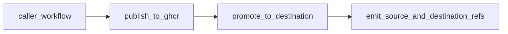

# gemara-publish-oci

GitHub Action for standardized Gemara OCI publishing:

1. Publish to a source registry (any OCI v2–compatible host).
2. Keyless sign + verify source digest.
3. Optionally copy to a **second** registry (caller-chosen host and path).
4. Verify trust on the destination using the standard re-sign model (default).

The action still does not define Gemara bundle semantics; manifest/media-type ownership remains in
[go-gemara](https://github.com/gemaraproj/go-gemara).

## Current design on demo branches

On `feat/demo-push-only*` branches, callers are using a **push-only** release mode:

- publish to GHCR (or another source registry)
- promote to a destination registry (for example Quay)
- no signing and no verification in the caller workflow

`oci-artifact` remains capable of sign/verify, but cross-registry verification authority lives in
caller repositories where destination credentials and release controls are managed.



## Publish modes (`publish_mode`)

| Value | Behavior |
|-------|----------|
| `layout-copy` | Copy `oci_layout_path:layout_ref` with `oras cp --from-oci-layout`. |
| `sdk` | Invoke `gemara_binary` + `sdk_args` and resolve digest from destination ref. |
| `gemara-file` | Delegate file-based pack+push (`file`, `validate`, `bundle_version`, `working_directory`) to the pinned compatibility action. |

## Promotion and trust

- Set `promote_to_destination: "true"` and **`destination_*`** inputs to copy the published tag to a
  second registry (for example GHCR → Quay or GHCR → another org registry).
- Standard path defaults (no extra inputs needed):
  - `trust_mode: resign`
  - `sign_destination: "true"`
  - `verify_destination: "true"`
- Optional compatibility trust modes remain available:
  - `copy-only`: copy payload tag only.
  - `copy-referrers`: recursive copy to include referrer graph when registry support is available.
- Source and destination verification default to issuer
  `https://token.actions.githubusercontent.com` (override with `cosign_certificate_oidc_issuer` when
  your signing environment differs).
- This repository's CI validates source-publish and source-signing behavior. Cross-registry
  promotion verification is authoritative in caller repositories (for example
  `complytime-policies`) where Quay credentials and release controls live.

## Key inputs

| Input | Description |
|-------|-------------|
| `registry`, `repository`, `tag` | Source destination for publish. |
| `username`, `password` | Source registry auth. |
| `sign_source`, `verify_source` | Source signature controls. |
| `promote_to_destination` | Enable promotion to `destination_*`. |
| `destination_registry`, `destination_repository`, `destination_tag`, `destination_username`, `destination_password` | Destination registry host, path without host, optional tag override, credentials. |
| `cosign_certificate_oidc_issuer` | Expected OIDC issuer for `cosign verify` (defaults to GitHub Actions). |
| `trust_mode` | `copy-only`, `copy-referrers`, or `resign`. |
| `verify_destination` | Destination signature verification control. |
| `allowed_identity_regex` | Optional cosign identity regex override. |

## Outputs

| Output | Description |
|--------|-------------|
| `digest` / `source_digest` | Source digest. |
| `source_ref` | Source image reference with digest. |
| `destination_digest` | Destination digest after promotion. |
| `destination_ref` | Destination image reference with digest. |
| `verified_source` | `true` if source verify passed. |
| `verified_destination` | `true` if destination verify passed. |
| `trust_mode` | Effective trust mode used. |

## Minimal caller example (Option 3)

```yaml
permissions:
  contents: read
  packages: write
  id-token: write

jobs:
  publish:
    runs-on: ubuntu-latest
    steps:
      - uses: actions/checkout@v4
      - id: publish
        uses: complytime/oci-artifact@<pinned-sha>
        with:
          publish_mode: gemara-file
          registry: ghcr.io
          repository: ${{ github.repository }}
          tag: ${{ github.ref_name }}
          file: bundles/cis-fedora-l1-workstation.yaml
          username: ${{ github.actor }}
          password: ${{ secrets.GITHUB_TOKEN }}
          promote_to_destination: "true"
          destination_registry: quay.io
          destination_repository: continuouscompliance/complytime-policies
          destination_username: ${{ secrets.QUAY_ROBOT_USERNAME }}
          destination_password: ${{ secrets.QUAY_ROBOT_TOKEN }}
```

## Pinning

Use a full commit SHA for production callers. Avoid floating refs.

## License

See [LICENSE](LICENSE).
