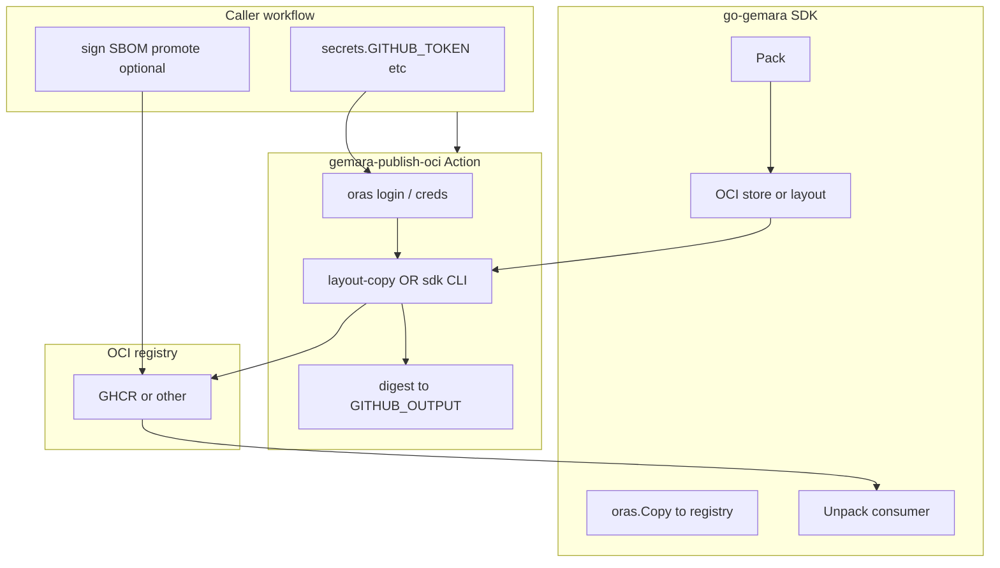

# Design: `gemara-publish-oci` GitHub Action (draft for review)

| Field | Value |
|-------|--------|
| **Status** | Draft — feedback welcome |
| **Primary reviewers** | Gemara / go-gemara maintainers |
| **Related upstream work** | [go-gemara#60 — Standardize Artifact Packaging and Distribution via OCI](https://github.com/gemaraproj/go-gemara/issues/60) |
| **Repository** | `OWNER/gemara-publish-oci` on GitHub (e.g. under a personal account or **`gemaraproj`** after transfer) |

---

## 1. Purpose

This document describes the **intended split of responsibilities** between:

- **[go-gemara](https://github.com/gemaraproj/go-gemara)** (Pack, manifest, media types, `oras.Copy` semantics), and  
- **`gemara-publish-oci`** (GitHub Actions glue: registry auth, pinned tools, `digest` output),

so that **OCI publishing in CI** stays aligned with [go-gemara#60](https://github.com/gemaraproj/go-gemara/issues/60) and does **not** duplicate layer-level ORAS details in a separate repo.

It is meant for **maintainer review** before wider adoption (e.g. complytime-policies publish pipelines, shared Actions under `gemaraproj`).

---

## 2. Problem statement (from upstream)

Today Gemara artifacts are produced and distributed in **inconsistent** ways across repositories. [go-gemara#60](https://github.com/gemaraproj/go-gemara/issues/60) proposes **OCI Artifacts** as the standard packaging format, with:

- A clear notion of a **Gemara bundle** in the SDK.  
- **`Pack` / `Unpack`** (or equivalent) in the Go SDK.  
- **Programmatic resolution** of catalogs (including imports) via **OCI URIs**.  
- Optionally, a **standard GitHub Action** to build/publish bundles.

This Action is one candidate for the **last bullet**: it should remain **thin** and defer semantics to the SDK.

---

## 3. Design principles

| Principle | Implication |
|-----------|-------------|
| **SDK is source of truth** | Manifest shape, `artifactType`, layer `mediaType`s, and Pack output are defined and implemented in **go-gemara**, not in this Action. |
| **Transport vs semantics** | Moving bytes to a registry uses **ORAS** (`oras cp` or `oras.Copy` inside a CLI); **what** those bytes mean is **SDK**. |
| **No layer assembly in the Action** | The Action does **not** implement multi-file `oras push` with per-descriptor annotations; that remains **org-infra / pipeline-specific** or **SDK** until the contract is stable (see [complytime org-infra#172](https://github.com/complytime/org-infra/issues/172), [complytime-policies OCI spec](https://github.com/complytime/complytime-policies/blob/main/docs/oci-publish-spec.md)). |
| **Pinning** | Callers pin **`@vX.Y.Z`** or commit SHA; ORAS CLI version is an input (`oras_version`). |

---

## 4. High-level architecture

**Target end state (SDK-led publish):** a **`gemara`** CLI (or subcommand) released from **go-gemara** performs **Pack → `oras.Copy` → remote tag**, using the same semantics as sketched in [#60](https://github.com/gemaraproj/go-gemara/issues/60). The Action runs that CLI under **`publish_mode: sdk`** with registry inputs and secrets.

**Interim state:** CI produces an **OCI image layout** on disk (e.g. export from Pack or a pipeline step); the Action runs **`oras cp --from-oci-layout`** under **`publish_mode: layout-copy`**. This matches the **on-disk layout** shape **complyctl** uses for policy cache ([001 research](https://github.com/complytime/complyctl/blob/main/specs/001-gemara-native-workflow/research.md): remote → layout via `oras.Copy`; here layout → remote).

---

## 5. Responsibilities (explicit)

| Component | Owns |
|-----------|------|
| **go-gemara** | `Pack` / `Unpack`, bundle definition, manifest and media types, **`oras.Copy`** from packed content to registry (when exposed as API or CLI). |
| **gemara-publish-oci** | Installing/using **pinned ORAS CLI** (layout mode), **`oras login`** with caller-provided credentials, invoking **optional `gemara` binary** (sdk mode), writing **`digest`** to `GITHUB_OUTPUT`. |
| **Caller workflow** (e.g. complytime-policies) | Checkout, **building/exporting** layout or installing SDK, **SLSA/SBOM/sign/promote** via org-infra where applicable. |

---

## 6. Action specification (surface)

Implementation: single composite step in **`action.yml`** (see repository root).

### 6.1 Inputs (summary)

| Input | Role |
|-------|------|
| `publish_mode` | `layout-copy` (default) or `sdk` |
| `registry`, `repository`, `tag` | Target OCI reference (no scheme in `registry`; standard `host` form) |
| `oci_layout_path` / `pack_path` | Root directory of OCI layout (`layout-copy`) |
| `layout_ref` | Reference inside layout for `oras cp PATH:REF` (`layout-copy`, required in that mode) |
| `gemara_binary`, `sdk_args` | Executable and arguments (`sdk` mode) |
| `username`, `password` | Registry auth (`password` omitted only when `plain_http: true`) |
| `oras_version` | ORAS CLI release (layout path + digest resolution) |
| `plain_http` | For HTTP registries (e.g. CI against `localhost:5000`) |

### 6.2 Environment passed to SDK CLI (`sdk` mode)

For interoperability with a future **`gemara`** CLI, the Action sets:

- `GEMARA_REGISTRY` — same as `registry` input  
- `GEMARA_REPOSITORY` — same as `repository` input  
- `GEMARA_TAG` — same as `tag` input  

(Exact CLI flags remain **TBD** in go-gemara; **`sdk_args`** allows callers to pass subcommands until a stable interface exists.)

### 6.3 Outputs

| Output | Meaning |
|--------|---------|
| `digest` | Manifest digest after push (`sha256:…`), via `oras resolve` when possible, else parsed from command output |

---

## 7. Modes (normative behavior)

### 7.1 `layout-copy` (default)

1. Install ORAS CLI (`oras_version`).  
2. Validate `oci_layout_path` contains `index.json`.  
3. `oras login` unless `plain_http` (anonymous HTTP registry).  
4. `oras cp --from-oci-layout "$path:$layout_ref" "$registry/$repository:$tag"`.  
5. Resolve digest and write `GITHUB_OUTPUT`.

### 7.2 `sdk`

1. Install ORAS (for digest resolution after push).  
2. Require `gemara_binary`; resolve on `PATH` if not an absolute executable path.  
3. Set `GEMARA_*` env vars.  
4. `oras login` as above.  
5. Execute `"$gemara_binary" $sdk_args` (caller-defined; **must** match go-gemara when stable).  
6. Resolve digest; write `GITHUB_OUTPUT`.

---

## 8. Non-goals (this Action)

- Gemara YAML **validation** (SDK / separate check).  
- **SLSA**, **SBOM**, **Cosign**, **Quay promotion** — stay in **caller** or **org-infra** reusable workflows.  
- Defining **canonical `artifactType`** strings — **go-gemara / Gemara** project.  

---

## 9. Questions for review (Gemara / SDK)

1. **CLI contract:** What stable command (and flags) should **`publish_mode: sdk`** assume—e.g. `gemara oci push …`? Should **`sdk_args`** be deprecated once a single subcommand accepts registry/repo/tag?  
2. **Layout export:** Will **Pack** guarantee an **OCI image layout** on disk (with a documented **`layout_ref`**) so **`layout-copy`** stays valid as a bridge?  
3. **Digest:** Should the SDK CLI print a machine-readable digest line, or is **`oras resolve`** after push always sufficient?  
4. **Home for the Action:** Is **`gemaraproj/gemara-publish-oci`** (or similar) the desired long-term org repo once the design is approved?  

---

## 10. References

- [go-gemara#60](https://github.com/gemaraproj/go-gemara/issues/60)  
- [complyctl 001 — research (OCI layout + `oras.Copy`)](https://github.com/complytime/complyctl/blob/main/specs/001-gemara-native-workflow/research.md)  
- [complytime-policies — OCI publish spec](https://github.com/complytime/complytime-policies/blob/main/docs/oci-publish-spec.md)  
- [org-infra#172 — reusable ORAS publish](https://github.com/complytime/org-infra/issues/172)  
- In-repo: [ARCHITECTURE.md](./ARCHITECTURE.md)  

---

*Document version: 1.0-draft. Maintainer edits via PR welcome.*
