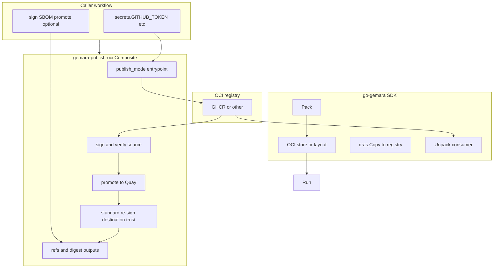

# Design: `gemara-publish-oci` GitHub Action (draft for review)

| Field | Value |
|-------|--------|
| **Status** | Draft — Option 3 standard re-sign promotion path implemented in composite action |
| **Primary reviewers** | Gemara / go-gemara maintainers |
| **Related upstream work** | [go-gemara#60 — Standardize Artifact Packaging and Distribution via OCI](https://github.com/gemaraproj/go-gemara/issues/60) |
| **Repository** | `OWNER/gemara-publish-oci` on GitHub (e.g. under a personal account or **`gemaraproj`** after transfer) |

---

## 1. Purpose

This document describes the current split of responsibilities between:

- **[go-gemara](https://github.com/gemaraproj/go-gemara)** (Pack, manifest, media types, `oras.Copy` semantics), and  
- **`gemara-publish-oci`** (publish orchestration: registry auth, sign/verify, optional promote),

so OCI publishing in CI stays aligned with [go-gemara#60](https://github.com/gemaraproj/go-gemara/issues/60)
without duplicating layer-level ORAS descriptor ownership.

It is meant for **maintainer review** before wider adoption (e.g. complytime-policies publish pipelines, shared Actions under `gemaraproj`).

---

## 2. Problem statement (from upstream)

Today Gemara artifacts are produced and distributed in **inconsistent** ways across repositories. [go-gemara#60](https://github.com/gemaraproj/go-gemara/issues/60) proposes **OCI Artifacts** as the standard packaging format, with:

- A clear notion of a **Gemara bundle** in the SDK.  
- **`Pack` / `Unpack`** (or equivalent) in the Go SDK.  
- **Programmatic resolution** of catalogs (including imports) via **OCI URIs**.  
- Optionally, a **standard GitHub Action** to build/publish bundles.

This Action is one candidate for the **last bullet**: it should remain **thin** and defer semantics to the SDK.

---

## 3. Design principles

| Principle | Implication |
|-----------|-------------|
| **SDK is source of truth** | Manifest shape, `artifactType`, layer `mediaType`s, and Pack output are defined and implemented in **go-gemara**, not in this Action. |
| **Transport vs semantics** | Moving bytes and promoting between registries uses ORAS; bundle meaning is still SDK-owned. |
| **No layer assembly in the Action** | The Action does not handcraft layer descriptor tables; publish semantics are delegated to SDK/compatibility tooling. |
| **Pinning** | Callers pin **`@vX.Y.Z`** or commit SHA; ORAS CLI version is an input (`oras_version`). |

---

## 4. High-level architecture (Option 3)

Target end state remains SDK-led publish, where `publish_mode: sdk` invokes a stable go-gemara CLI.

Interim compatibility also includes `publish_mode: gemara-file`, which delegates file-based bundle
pack/push while the composite handles trust and promotion orchestration.

---

## 5. Responsibilities (explicit)

| Component | Owns |
|-----------|------|
| **go-gemara** | `Pack` / `Unpack`, bundle definition, manifest and media types, **`oras.Copy`** from packed content to registry (when exposed as API or CLI). |
| **gemara-publish-oci** | Publish source image, sign/verify source, optionally promote to Quay, enforce trust mode, emit source/destination outputs. |
| **Caller workflow** | Checkout, provide inputs/secrets, set release controls and environment gates, and run authoritative cross-registry verification in its own environment. |

## 5.1 Current demo-mode profile

For current demo branches, caller workflows are using:

- `sign_source: false`
- `verify_source: false`
- `trust_mode: copy-only`
- `sign_destination: false`
- `verify_destination: false`

This validates pack/publish/promotion plumbing while deferring signature policy validation.

---

## 6. Action specification (surface)

Implementation: single composite step in **`action.yml`** (see repository root).

### 6.1 Inputs (summary)

| Input | Role |
|-------|------|
| `publish_mode` | `layout-copy`, `sdk`, or `gemara-file` |
| `registry`, `repository`, `tag` | Target OCI reference (no scheme in `registry`; standard `host` form) |
| `oci_layout_path` / `pack_path` | Root directory of OCI layout (`layout-copy`) |
| `layout_ref` | Reference inside layout for `oras cp PATH:REF` (`layout-copy`, required in that mode) |
| `gemara_binary`, `sdk_args` | Executable and arguments (`sdk` mode) |
| `file`, `validate`, `bundle_version`, `working_directory` | File-based pack/push delegation (`gemara-file`) |
| `username`, `password` | Registry auth (`password` omitted only when `plain_http: true`) |
| `oras_version` | ORAS CLI release (layout path + digest resolution) |
| `sign_source`, `verify_source` | Source trust controls |
| `promote_to_destination`, `destination_*` (legacy `promote_to_quay`, `quay_*`) | Destination promotion and auth controls |
| `trust_mode`, `sign_destination`, `verify_destination` | Destination trust controls (`resign` is the standard path) |
| `allowed_identity_regex`, `cosign_certificate_oidc_issuer`, `cosign_version` | Signature verification policy and tooling pinning |
| `plain_http` | For HTTP registries (e.g. CI against `localhost:5000`) |

### 6.2 Environment passed to SDK CLI (`sdk` mode)

For interoperability with a future **`gemara`** CLI, the Action sets:

- `GEMARA_REGISTRY` — same as `registry` input  
- `GEMARA_REPOSITORY` — same as `repository` input  
- `GEMARA_TAG` — same as `tag` input  

(Exact CLI flags remain **TBD** in go-gemara; **`sdk_args`** allows callers to pass subcommands until a stable interface exists.)

### 6.3 Outputs

| Output | Meaning |
|--------|---------|
| `digest` / `source_digest` | Source manifest digest |
| `source_ref` | Source image reference with digest |
| `destination_ref`, `destination_digest` | Destination reference/digest after promotion |
| `verified_source`, `verified_destination` | Verification status booleans |
| `trust_mode` | Effective destination trust mode |

---

## 7. Modes (normative behavior)

### 7.1 `layout-copy` (default)

1. Install ORAS CLI (`oras_version`).  
2. Validate `oci_layout_path` contains `index.json`.  
3. `oras login` unless `plain_http` (anonymous HTTP registry).  
4. `oras cp --from-oci-layout "$path:$layout_ref" "$registry/$repository:$tag"`.  
5. Resolve digest and write `GITHUB_OUTPUT`.

### 7.2 `sdk`

1. Install ORAS (for digest resolution after push).  
2. Require `gemara_binary`; resolve on `PATH` if not an absolute executable path.  
3. Set `GEMARA_*` env vars.  
4. `oras login` as above.  
5. Execute `"$gemara_binary" $sdk_args` (caller-defined; **must** match go-gemara when stable).  
6. Resolve digest; write `GITHUB_OUTPUT`.

---

## 8. Non-goals (this Action)

- Gemara YAML **validation** (SDK / separate check).  
- SLSA/SBOM attestation policy ownership (these remain caller/org standards concerns).  
- Defining **canonical `artifactType`** strings — **go-gemara / Gemara** project.  

---

## 9. Questions for review (Gemara / SDK)

1. Should `copy-referrers` remain a supported compatibility mode now that re-sign is the standard path?
2. Should `gemara-file` remain as compatibility mode long-term, or be replaced by stable `sdk` usage?
3. What minimum caller permissions contract should be enforced by policy checks across org repos?

---

## 10. References

- [go-gemara#60](https://github.com/gemaraproj/go-gemara/issues/60)  
- [complyctl 001 — research (OCI layout + `oras.Copy`)](https://github.com/complytime/complyctl/blob/main/specs/001-gemara-native-workflow/research.md)  
- [complytime-policies — OCI publish spec](https://github.com/complytime/complytime-policies/blob/main/docs/oci-publish-spec.md)  
- [org-infra#172 — reusable ORAS publish](https://github.com/complytime/org-infra/issues/172)  
- In-repo: [ARCHITECTURE.md](./ARCHITECTURE.md)  

---

*Document version: 1.0-draft. Maintainer edits via PR welcome.*
